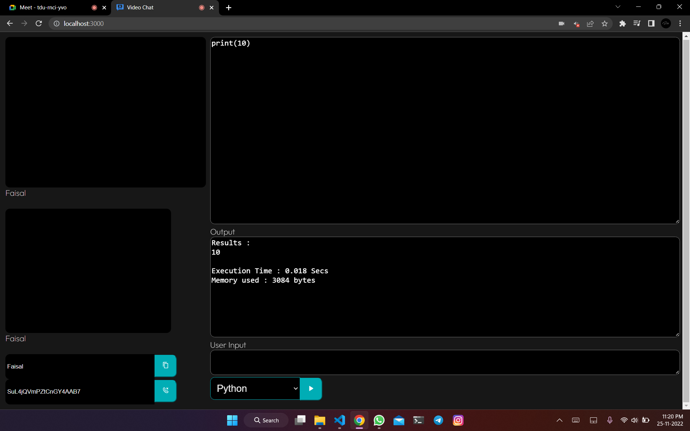

# **Coding Interview Platform**

Became tired of companies still using zoom or google meet to take coding interviews which have nowhere to code. They even make you code in google docs because of this. So this allows the companies to conduct their coding interviews with an in-built IDE which supports the majority of the languages.

[Live Application](https://faisalsaifii.github.io/Coding-Interview-Platform/)



## **Backend Dependencies**

### **Express**

- Back End Web Application Framework
- Building RESTful APIs with Node.js

    ```
    npm i express
    ```

### **Socket.io**

- Event-driven library for real-time web applications
- Enables real-time, bi-directional communication between web clients and servers

    ```
    npm i socket.io
    ```

### **Nodemon**

- Restarts node app whenever change is observed in the file present in the working directory of the project

    ```
    npm i nodemon
    ```

### **Cors**

- Cross-origin resource sharing
- Mechanism that allows restricted resources on a web page to be requested from another domain outside the domain from which the first resource was served

    ```
    npm i cors
    ```

## **Front End Dependencies**

### React Copy to Clipboard

- Installation Command

    ```
    npm i react-copy-to-clipboard
    ```

### Socket IO Client

- Installation Command

    ```
    npm i socket.io-client
    ```

### Simple Peer

- Installation Command

    ```
    npm i simple-peer
    ```

## Run on Local Machine

- Run in root directory:
  - Install dependencies:
    ```
    npm i
    ```

  - Run server using Nodemon:
    ```
    npm run devStart
    ```

- Run in client directory:
  - Install Dependencies:
    ```
    npm i
    ```

  - Start Client:
    ```
    npm start
    ```